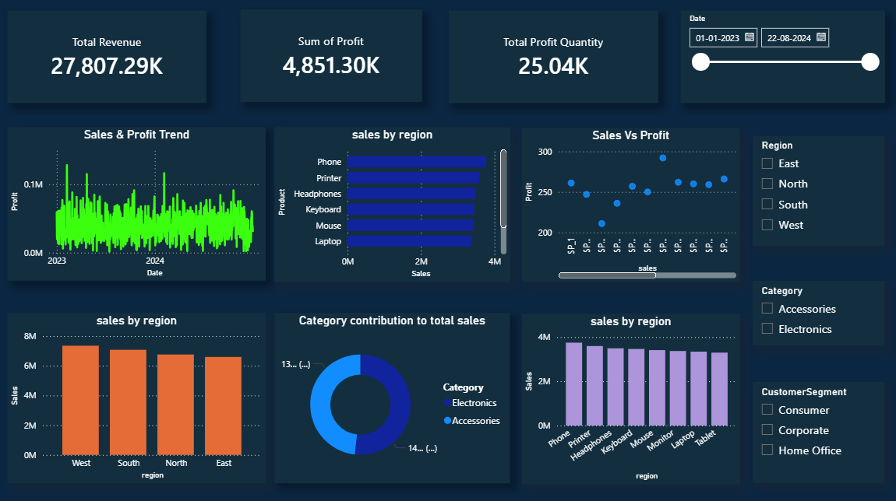

📊 Sales Analysis Dashboard (Power BI)

📌 Project Overview

This project analyzes retail sales performance across products, regions, and salespersons.
The dashboard helps identify trends, top-performing areas, and business insights.

🎯 Objectives

* Track total sales, profit, and quantity
* Analyze sales trends over time
* Identify top-performing products and regions
* Evaluate salesperson performance
* Compare sales vs profit relationships

📂 Dataset

The dataset contains 5000 records with the following fields:

* Date
* Product
* Category
* Region
* Salesperson
* Customer Segment
* Quantity
* Sales Amount
* Profit
* Target

📊 Dashboard Features

* KPI Cards (Total Sales, Profit, Quantity)
* Sales Trend Line Chart
* Sales by Region (Column Chart)
* Top Selling Products (Bar Chart)
* Category Contribution (Donut Chart)
* Salesperson Performance
* Sales vs Profit (Scatter Plot)
* Interactive Slicers (Date, Region, Category, Segment)

🛠 Tools Used

* Power BI
* DAX
* Data Cleaning & Transformation

📸 Dashboard Preview

🚀 Key Insights

* Certain regions contribute significantly more to revenue
* A few products dominate overall sales
* Strong correlation between sales and profit
* Performance varies across salespersons

---

## 📥 How to Use

1. Download the `.pbix` file
2. Open in Power BI Desktop
3. Interact with slicers to explore insights

---

## ⭐ Author

Vishnu A Nambiar
